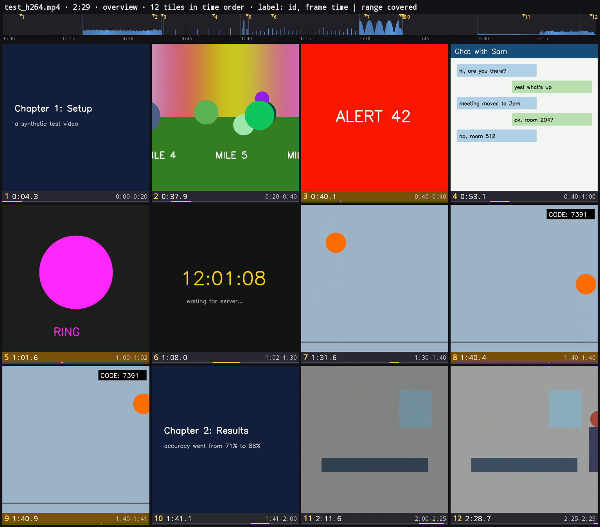
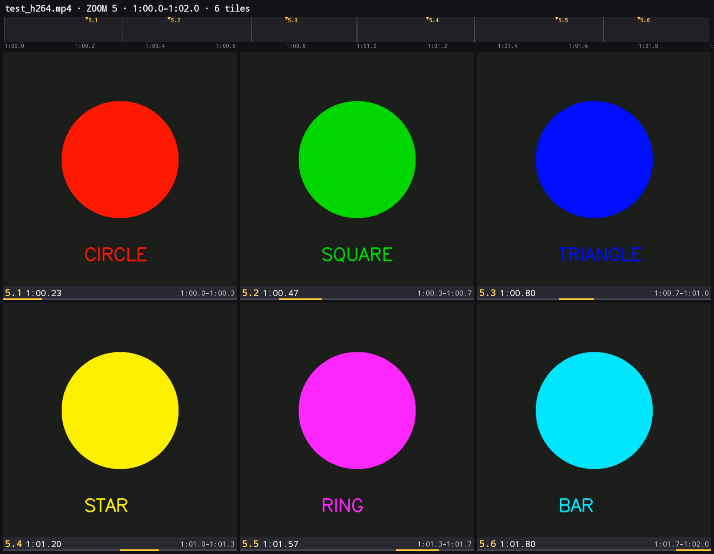

# Vistile

**Turn a video into a compact, timestamped visual timeline that multimodal AI models can read.**

Vistile is an Android app that picks the frames that matter from a video and lays them out as contact sheets. Each tile is labelled with an ID, the frame's timestamp, and the time range it stands for. Hand the sheets to any AI chat instead of the video, and it can follow what happens and when, and refer back to exact moments. If a part needs a closer look, zoom into any tile for a denser sheet of just that range.

<p align="center">
  
  
</p>

## Features

- **Content-aware frame selection**: static stretches collapse into one tile, busy parts get more, and brief events (a 0.5 s flash, a small overlay) get their own tile. There are no near-duplicate tiles.
- **Tile count decided by the video**: a slider sets the maximum number of images (1–6, up to 16 tiles each), since each image costs an AI about the same however full it is. Busy videos spread over several sheets, with IDs continuing across sheets.
- **Fill sheets (optional)**: each image costs the same however full it is, so this setting keeps adding tiles until the last image is full. It only adds clearly visible changes that aren't shown yet, so a static video still gets a few large tiles (e.g. the music video goes from 33 to 48 tiles on the same 3 images).
- **Time ranges, not just timestamps**: every tile shows the range it represents and a position bar. A strip at the top of each sheet plots visual change over the whole video.
- **Progressive zoom**: tap a tile (or type `7`, `7.3` or `1:00-1:20`) to re-analyse that range more densely, up to every frame. IDs are hierarchical (`7` → `7.1…7.16`).
- **Ready for AI chats**: "Save sheets" writes the PNGs to `Pictures/Vistile`, and "Copy prompt" copies a short note explaining how to read them.
- **English and Chinese**: follows the phone's language, with a switch in the header.
- **Fully on-device**: hardware video decoding and no network access.

## How it works

The algorithm is **budgeted coverage segmentation**: split the video into contiguous time ranges so that every frame is visually close to its range's representative frame.

1. **Signatures**: frames are sampled at about 10 per second (up to every frame when zoomed) and reduced to tiny signatures read directly from the decoder's YUV planes. Each signature has four parts:
   - 32×32 luma, normalised for brightness and contrast so lighting drifts don't count as change
   - 8×8 chroma
   - a top-k local-change term that catches small overlays
   - a sharpness/detail score used to pick each tile's frame
2. **Greedy splitting**: repeatedly split the range with the highest `min(worst deviation, cap) / cap × √(duration share)`. Candidate split points are the SSE-optimal point, the edges of the worst-represented frame, and the biggest frame-to-frame jumps. The chosen split is the one that minimises the larger half's priority, which keeps busy footage from being peeled off one frame at a time.
3. **Brief events**: a pair of exceptional jumps (in and out) 0.25–2 s apart is treated as a brief event. The whole event is cut out in one step and gets an amber label.
4. **Stopping**: a range keeps splitting while it still has unrepresented change and is longer than `2 × minDur × cap / min(deviation, cap)`, with `minDur = T/40` kept between 1.5 s and 60 s. Clear content changes are resolved finely, while noise or a ticking clock must last longer before earning another tile.
5. **Layout**: tiles are split evenly over as few sheets as possible (≤ 16 tiles each, at most 1536 px wide), which fits typical vision-model input sizes.

## Results

**Synthetic benchmark**: `prototype/gen_test_video.py` generates a 150 s video with 11 known events: static cards, a pan, a 0.5 s flash, a 2 s montage of 6 shapes, a small 1 s overlay, a ticking clock, a brightening noisy room, and a walking figure.

| Method | Images | Tiles | Events shown | Brief events (of 3) | Near-duplicate pairs |
|---|---|---|---|---|---|
| Uniform sampling | 1 | 20 | 8/11 | 0 | 6 |
| Visual-change peaks | 1 | 16 | 8/11 | 2 | 0 |
| Uniform + peaks | 2 | 36 | 10/11 | 2 | 11 |
| **Vistile** (fixed budget of 12) | **1** | **12** | **11/11** | **3** | **0** |
| **Vistile** (auto count, on phone) | 2 | 28 | 11/11 | 3 | 0 |

Zooming into the 2 s montage returns exactly 6 tiles, one per shape. The algorithm stops early because nothing else is left to show. Example sheets are in [`docs/synthetic/`](docs/synthetic).

**Real video**: a 193 s, 60 fps music video (11,600 frames). Vistile chose 33 tiles on 3 sheets, and almost every tile shows a different lyric line. The same video sampled as 20 uniform + 16 change-peak frames repeated its chorus shot several times. The first version of the algorithm failed on this video (constant beat-synced motion sent 7 of 15 tiles to the first 2 s), which led to the balanced-split and brief-event rules above. The sheets aren't included here because the video is third-party content.

**Speed** (Xiaomi 23117RK66C): a 150 s, 720×720, 60 fps video is analysed in about 18 s and a 193 s one in about 26 s, plus 2–9 s to select and draw the sheets. A zoom takes a few seconds.

## Install

Download `Vistile-<version>.apk` from [Releases](../../releases) and open it on your phone. Android will ask you to allow installs from your browser or file manager. It needs Android 10 or newer.

## Build

Requirements: JDK 17 and the Android SDK (platform 36).

```bash
cd android
./gradlew assembleDebug
```

The APK is written to `android/app/build/outputs/apk/debug/`. Min SDK 29 (Android 10).

## Known limits

- Tested on one synthetic and one real video so far. Handheld camera footage and screen recordings still need checking.
- A small overlay right next to a moving object is borderline and can be missed.
- For content that builds up (a chat filling in), a tile shows the middle state. A zoom shows the rest.
- No audio or transcript yet. Subtitle lines under each tile, aligned to its range, are a natural next step.
- Analysis decodes every frame (~500 fps on the test phone). Long videos could use a keyframe-only first pass.

## License

[Apache 2.0](LICENSE)
